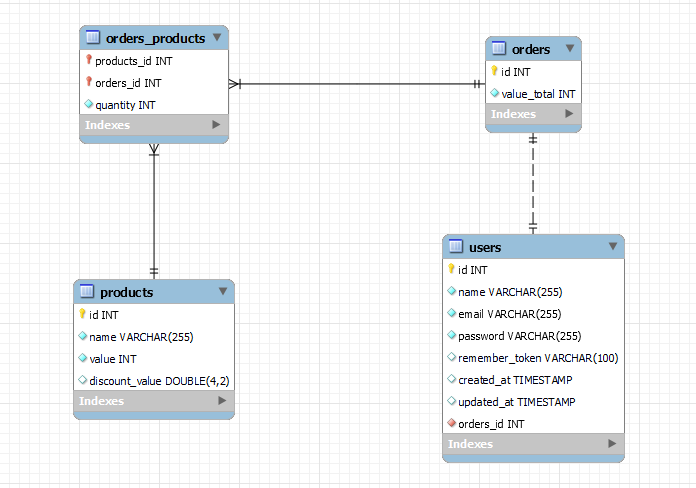

## Back-end

Aqui foi onde eu iniciei a codificação, utilizei a ferramenta sail para iniciar um projeto com o docker, assim não sendo necessario instalar o PHP e/ou outro servidor web na maquina para rodar a aplicação. O banco de dados utilizado para armazenar as informações é o MySQL.

## Migrations

Primeiramente foi criados as migrations necessarias para criação das tabelas e suas respectivas colunas.

## Models

A seguir foi criado as models e seus relacionamentos. Abaixo é possivel visualizar o modelo do banco de dados.

<p align="center">
  
</p>

## Rotas e Controllers

Por fim foi realizado a criação das rotas e dos controllers, onde fica armazenado as regras de negocio da aplicação. Com exeção da rota de login e criação de usuario é necessario o envio do token do usuario nos headers da requisição.

### Criação de usuário [POST /user]

Rota responsavel por criar um usuario e retornar seu e-mail e token, já autentica ele na sessão.

+ Request (application/json)
   + Body

            {
               "name": "Teste",
                "email": "teste@email.com",
                "password": "12345678"
            }

+ Response 200 (application/json)
    + Body

            {
                "email": "teste@email.com",
                "token": "1|1SCjXjRHhGxWk7VLHXxlyJQkp8jkQB12JIDETn1Q"
            }

### Login de usuário [POST /session]

Rota responsavel realizar a autenticação do usuário e retornar o e-mail e token de autenticação.

+ Request (application/json)
   + Body

            {
                "email": "teste@email.com",
                "password": "12345678"
            }

+ Response 200 (application/json)
    + Body

            {
                "email": "teste@email.com",
                "token": "1|1SCjXjRHhGxWk7VLHXxlyJQkp8jkQB12JIDETn1Q"
            }

### Criação de pedido [POST /order]

Rota responsavel por criar um pedido e armazenar as informações no banco de dados.

+ Request (application/json)

    + Headers

                Authorization: Bearer [token]
   + Body

           {
                "products": [
                    {
                        "name": "teste",
                        "value": "120.00",
                        "quantity": 2,
                        "discount_value": "0.25"
                    },
                    {
                        "name": "teste2",
                        "value": "130.00",
                        "quantity": 1
                    }
                ],
                "order":{
                    "value_total": "250.00"
                }
                
            }

+ Response 200 (application/json)
    + Body

            {
                "products": [
                    {
                        "name": "teste",
                        "value": "120.00",
                        "quantity": 2,
                        "discount_value": "0.25"
                    },
                    {
                        "name": "teste2",
                        "value": "130.00",
                        "quantity": 1
                    }
                ],
                "order":{
                    "value_total": "250.00"
                }
                
            }

## Status Codes

| Status Code | Description |
| :--- | :--- |
| 200 | `OK` |
| 201 | `CREATED` |
| 401 | `NOT AUTHORIZED` |
| 404 | `NOT FOUND` |
| 500 | `INTERNAL SERVER ERROR` |

## Como Rodar o projeto

Como ja citado anterirmente é necessario o docker instalado na maquina.

Clone este projeto em um diretório e mude para o diretório backend:

```console
cd backend
```

Rode o seguinte comando para instar as dependencias da pasta vendor:

```console
docker run --rm \
    -u "$(id -u):$(id -g)" \
    -v $(pwd):/var/www/html \
    -w /var/www/html \
    laravelsail/php81-composer:latest \
    composer install --ignore-platform-reqs
```

Copie o arquivo .env.example para .env e insira as configs de banco de dados (fica a sua escolha):

```console
cp .env.example .env
```

Suba o servidor:

```console
./vendor/bin/sail up -d
```

E por fim rode as migrations:

```console
./vendor/bin/sail artisan migrate
```

E pronto, a aplicação esta disponivel no seguinte endereço:

```console
http://localhost/api
```
