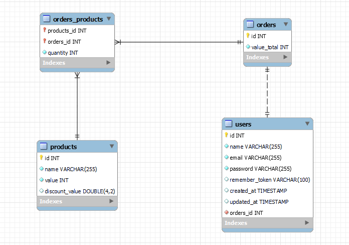

## Front-end

Apos terminar o back-end e testalo, parti para o desenvolvimento do front, a aplicação foi construida com o react, usei a ferramente vite para criar o projeto, alem disso ele usa um bundle mais rapido que o usado no create-react-app. A estilização foi realizada puramente com react, usando flex grid e grid template para a listagem dos produtos.

## Tela Home

Primeira tela que foi criada é a home, aqui é realizado a listagem dos produtos que vem da API. Como os dados advem diferentes, primeiramente busco da o productos nacionais, armazeno em um array e refaço o mesmo procedimeto com os produtos europeus, apos isso listo em tela, mostra a imagem do produto, o nome, valor e quando existente o valor com desconto, o valor antigo dele e quanto de desconto que foi aplicada. E por fim existe o botão de adicionar ao carrinho, que quando clicado pela primeira vez no produto retorna uma mensagem de sucesso informando que o produto foi adicionado ao carrinho e no topo da pagina a contagem de itens do carrinho é atualizada. O funcionamento do carrinho será explicado mais a frente.
Foi criado uma barra de busca, onde é possivel filtrar pelo nome dos produtos. A baixo é possivel visualizar a tela Home.

<p align="center">
  
</p>

## Tela do carrinho

Para o gerenciamento dos produtos selecionados, foi criado a tela de carrinho, onde é listado todos os produtos, suas quantidades, subtotal e total do pedido. É possivel aumentar ou diminuir a quantidade de produtos, caso seja diminuido para zero, ele remove o produto do carrinho. existe tambem a possibilidade de remover o produto no icone de lixeira. Sempre que ocorre uma alteração na quantidade o subtotal e total do pedido são atualizados em real time. Ainda na pagina existem outros dois botões o de limpar o carrinho, que basicamente exclui todos os produtos do carrinho. E o botão de finalizar pedido, que quando acionado faz o envio dos dados para o back-end que por sua vez cria o pedido e armazena as informações no banco de dados. Caso essa operação ocorra com sucesso, é retornado uma mensagem de sucesso, o usuario é direcionado para a tela Home e o carrinho é limpo.

## Como Rodar o projeto
Como ja sitado anterirmente é necessario o docker instalado na maquina.

Clone este projeto em um diretório e mude para o diretório de back-end:

```console
cd backend
```

Rode o seguinte comando para instar as dependencias da pasta vendor:

```console
docker run --rm \
    -u "$(id -u):$(id -g)" \
    -v $(pwd):/var/www/html \
    -w /var/www/html \
    laravelsail/php81-composer:latest \
    composer install --ignore-platform-reqs
```

Copie o arquivo .env.example para .env e insira as configs de banco de dados (fica a sua escolha):

```console
cp .env.example .env
```

Suba o servidor:

```console
./vendor/bin/sail up -d
```

E por fim rode as migrations:

```console
./vendor/bin/sail artisan migrate
```

E pronto, a aplicação esta disponivel no seguinte endereço:

```console
http://localhost/api
```
