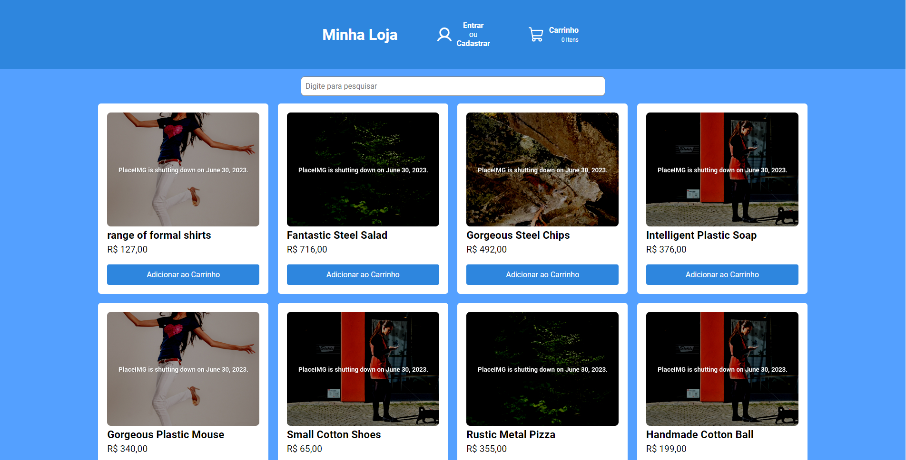
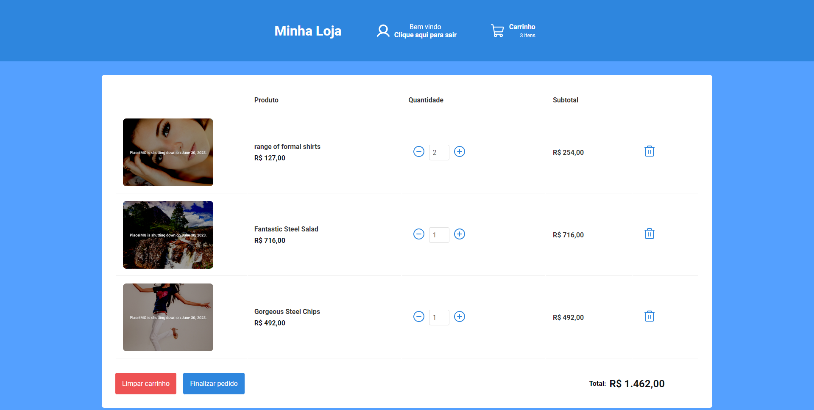
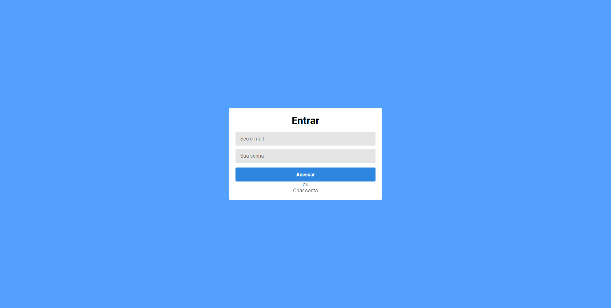
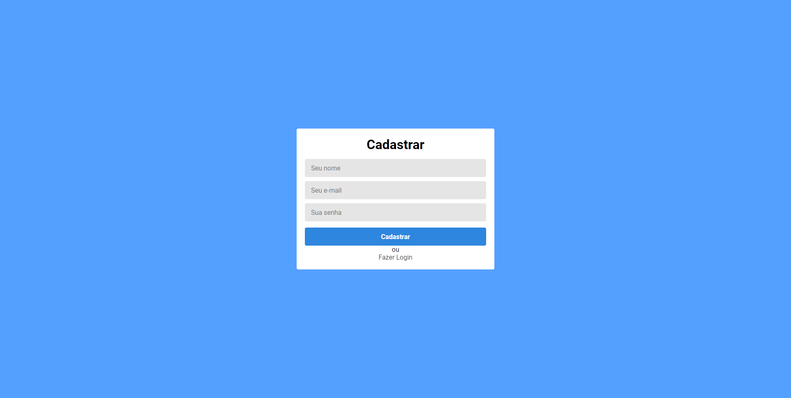

## Front-end

Apos terminar o back-end e testalo, parti para o desenvolvimento do front, a aplicação foi construida com o react, usei a ferramente vite para criar o projeto. A estilização foi realizada puramente com css, usando flex-grid e grid-template para a listagem dos produtos.

## Tela Home

<p align="justify">
    A primeira tela que foi criada é a home, aqui é realizado a listagem dos produtos que vem da API. Como os dados advêm diferentes, primeiramente busco os produtos nacionais, armazeno em um array e refaço o mesmo procedimento com os produtos europeus, após isso listo em tela, mostrando a imagem do produto, o nome, valor e quando existente o valor com desconto, o valor antigo dele e quanto de desconto que foi aplicado. E por fim existe o botão de adicionar ao carrinho, que quando clicado pela primeira vez no produto retorna uma mensagem de sucesso informando que o produto foi adicionado ao carrinho e no topo da página a contagem de itens do carrinho é atualizada, o funcionamento do carrinho será explicado mais à frente. Foi criada uma barra de busca, onde é possível filtrar pelo nome dos produtos. Abaixo é possível visualizar a tela Home.
</p>

<p align="center">
    
</p>

## Tela do carrinho

<p align="justify">
    Para o gerenciamento dos produtos selecionados, foi criado a tela de carrinho, onde é listado todos os produtos, suas quantidades, subtotal e total do pedido. É possível aumentar ou diminuir a quantidade de produtos, caso seja diminuído para zero, ele remove o produto do carrinho. Existe também a possibilidade de remover o produto no ícone de lixeira. As informações do carrinho ficam salvas no local storage, assim é possível atualizar a página ou reabrir ela e as informações continuam no carrinho.
</p>

<p align="justify">
    Sempre que ocorre uma alteração na quantidade, o subtotal e total do pedido são atualizados em tempo real. Ainda na página existem outros dois botões, o de limpar o carrinho, que basicamente exclui todos os produtos do carrinho.
</p>

<p align="justify">
    O botão de finalizar pedido quando acionado, verifica se o usuário está logado, caso não esteja, é direcionado para a página de login/cadastro.
</p>

<p align="justify">
    Caso o usuário já esteja autenticado, faz o envio dos dados para o back-end que por sua vez cria o pedido e armazena as informações no banco de dados. Caso essa operação ocorra com sucesso, é retornada uma mensagem de sucesso, o usuário é direcionado para a tela Home e o carrinho é limpo.
</p>

<p align="center">
  
</p>

## Tela de Login

<p align="justify">
   A tela de login é bem simples, é necessário um e-mail e senha para autenticar. Ao realizar o login, o back-end devolve o e-mail e o token de autenticação, que são salvos no local storage.
</p>

<p align="center">
  
</p>

## Tela de Cadastro

<p align="justify">
    Para realizar o cadastro é necessário inserir um nome, e-mail e senha. Essas informações são enviadas para o back-end, onde a API salva no banco de dados e retorna o usuário autenticado e o token.
</p>

<p align="center">
  
</p>

## Como Rodar o projeto
Como ja citado anterirmente é necessario o docker instalado na maquina.

Clone este projeto em um diretório e mude para o diretório frontend:

```console
cd frontend
```

Start the dockers containers.

```console
docker-compose up -d
```
O aplicativo estará disponível em

```console
http://localhost:3001/
```
